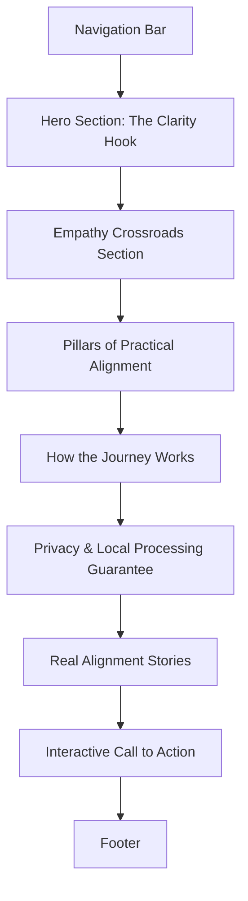

# qSpirit Guide: Page Organization & Marketing Strategy Proposal

This document outlines a strategic plan to reorganize the qSpirit Guide platform. The goal is to better communicate the platform's core purpose—helping people find life and career direction—to a target audience of young adults through middle-age seekers, while emphasizing that the service is completely free, runs locally in the browser, and respects user privacy.

---

## 🎯 Target Audience & Positioning

### The Demographic
* **Young Adults (Ages 20–35):** Graduates, career starters, and quarter-life transitioners facing decision paralysis, intense burnout, or a disconnect between their degree/job and their core values.
* **Middle-Aged Seekers (Ages 35–50):** Established professionals experiencing mid-life reflections, career fatigue, or major life shifts (divorce, empty nesting, industry shifts), seeking to pivot toward roles and lifestyles that bring genuine joy and meaning.

### Core Pain Points & Desires

1. **Decision Paralysis:** The terrifying feeling that choosing one path kills all other potential lives.
2. **Career Mismatch:** Working for a paycheck but feeling disconnected from a deeper sense of contribution and happiness.
3. **Fear of "Too Late":** Believing that switching paths or starting over in middle age or after years of study is an evolutionary failure.
4. **Desire for Safe Reflection:** A need for a space to query their values and map out alternative futures without the pressure of algorithms, monetized upselling, or data harvesting.

### Reframing the Cosmic Metaphor (The Pivot)

The current branding is highly abstract and spiritual-cosmic (*"quantum entanglement alignment coefficients," "expanding your essence," "eternal connection to Source"*). While this aesthetic is premium and modern, it can feel too esoteric to a seeker looking for practical career advice or life direction.

**The Solution:** Ground the quantum physics and multiverse themes into **relatable psychological frameworks**.
* **The Multiverse** represents **your untapped potential, alternative career choices, and parallel possibilities**.
* **Quantum Entanglement** represents **the connection between your deep inner values and external opportunities**.
* **Navigation** represents **intentional life and career planning**.
* **"No Wrong Choices"**: Use the multiverse concept to reassure seekers that every choice they have made, and will make, is a valuable branch of their personal growth—removing the anxiety of making a "mistake."

---

## 🔒 The Privacy, Local Processing & Cost Imperative

Self-exploration is a highly vulnerable process. To answer deep questions about career dissatisfaction, personal values, or secret passions, users must feel completely safe. If they suspect their data is being tracked, aggregated, or sold to advertisers, they will withhold their honest thoughts.

* **100% Local AI Processing (transformers.js):** The custom LLM runs directly in the user's web browser utilizing their device's GPU/CPU. Chat conversations never leave their machine and are not sent to any cloud servers.
* **Zero Tracker Policy:** qSpirit Guide does not sell user profiles, use tracking cookies, or sell access to third-party databases. Past conversations are stored in `localStorage` or `IndexedDB` exclusively.
* **Completely Free Access:** Eliminating paywalls, subscriptions, and upsells creates a low-friction, welcoming entry point. It frames the tool as a public service or gift rather than a lead generator for coaches.

---

## 🗺️ Landing Page Section-by-Section Reorganization

Here is a proposed restructure of the Landing Page ([HomePage.tsx](file:///Users/adir1/git/qspiritguide/src/components/HomePage.tsx)) to align with the strategy:



### 1. Navigation Bar
* **Proposed Labels & Sub-labels:**
  * **The Gateway** *(Home)*
  * **Path Mapping** *(Interactive Portal)*
  * **Stillness Chamber** *(Meditation Helper)*
  * **Memory Vault** *(Past Conversations)*
* **Visual Treatment:** A subtle, glassmorphic layout. The logo (a compass) should have a soft, pulsing violet/blue aura instead of a bright red spinner, evoking high-tech tranquility.

### 2. Hero Section: The Clarity Hook
* **Objective:** Instantly connect the seeker's feeling of confusion with a promise of structured clarity, emphasizing privacy and zero cost.
* **Proposed Headline & Sub-Headline:**
  > **Headline:** "Map the Multiverse of Your Potential."  
  > **Sub-Headline:** "Feeling stuck? Run a private AI guide directly in your browser. Tune its voice, map your alternate paths, and align with your true direction. 100% Free. 100% Private."
* **Copy Adjustment:** Replace the greeting *"Welcome back, traveler!"* (which implies they have been here before) with a warm invitation: *"Every choice is a path. Let’s map yours."*
* **Imagery Concept (Replacement):**
  * *Current Image:* A lone person on a cliff looking at a giant purple cosmic sphere. (A bit isolating and sci-fi).
  * *Proposed Image:* A high-quality, modern, double-exposure digital illustration showing a silhouette of a person gazing forward. Inside their silhouette is a network of glowing, warm paths branching out through a forest that transitions into a clean starscape. The color palette should use warm gold, soft violet, and twilight indigo.
  * *Rationale:* This visually connects the human element (the seeker) with choices and branching pathways, making the multiverse concept immediately intuitive and warm.

### 3. The Empathy Crossroads Section (New Section)
* **Objective:** Create immediate resonance by mirroring the user's current emotional state.
* **Core Copy:**
  > "Are you standing at a crossroads? Whether you are a young adult looking for a path that feels authentic, or a mid-career professional seeking to pivot toward joy, decision paralysis is real. We tend to view our choices as high-stakes gambles. But what if there are no wrong moves—only different versions of you waiting to unfold?"
* **Visual Elements:** A three-column grid highlighting common transition stages:
  1. *The Spark (20s):* Graduating or entering the workforce, feeling overwhelmed by choices and expectations.
  2. *The Pivot (30s-40s):* Established in a career but experiencing burnout, looking for deeper meaning and joy.
  3. *The Rebirth (45+):* Re-evaluating values, looking to transition past success into genuine fulfillment.
* **Imagery Concept:** Clean, minimal line-art illustrations representing these stages (e.g., a seedling growing, a road splitting into distinct but beautiful landscapes, and a compass realigning under starlight).

### 4. Reimagining the Pillars (Feature Cards)
* **Objective:** Make the "Pillars of Navigation" feel actionable and practical rather than just esoteric principles.

| Current Feature | Proposed Reframing | Core Copy Proposal |
| :--- | :--- | :--- |
| **Quantum Entanglement** | **Value Alignment** | "Identify the core values and passions that make you tick. Understand how they link (or entangle) with real-world careers to find your natural fit." |
| **Multiverse Navigation** | **Path Mapping Sandbox** | "Simulate and chart multiple life and career trajectories. Visualize choice branches risk-free, helping you make transitions with confidence." |
| **Consciousness Expansion** | **Introspection Tools** | "Access reflective journaling prompts, cognitive exercises, and guidance worksheets designed to cut through noise and clarify your focus." |

* **Imagery Concept (Replacement for each card):**
  * *Value Alignment Image (replacing current Entanglement image):* An abstract representation of two glowing nodes connecting via a series of elegant lines, using a warm rose-gold and soft peach color palette. It should look like a clean graphic design representation of alignment.
  * *Path Mapping Sandbox Image (replacing current Navigation image):* A mockup of the interactive choice-tree interface—showing a beautiful, simplified flow chart with branches labeled with careers (e.g., *Creative*, *Tech*, *Community*) that light up as a hand hovers over them.
  * *Introspection Tools Image (replacing current Expansion image):* A flat-lay digital illustration showing a clean journal, a pen, a cup of tea, and floating, soft, warm-colored stars above it. This communicates a peaceful, grounded, reflective practice.

### 5. The Privacy and Local Processing Guarantee
* **Objective:** Reassure the user that this is a safe space for deep vulnerability.
* **Core Copy:**
  > "Your path is your business. Because our custom AI runs entirely on your computer via transformers.js, we do not compile user profiles, use tracking cookies, or transmit your conversations to any server. Your thoughts remain entirely yours."
* **Visual Elements:** Clean, trust-building icons (e.g., a shield outline with an embedded compass, a lock made of starlight). Use a grid showing:
  * **Zero Cost:** No paywalls, premium plans, or ads.
  * **Local Processing:** The AI model runs in your browser.
  * **Local Storage:** Conversations save only to your device.
  * **Privacy-First Access:** Turnstile integration keeps the site secure without Google reCAPTCHA's browser tracking.

### 6. Interactive Journey Preview (How It Works)
* **Objective:** Give a simple 1-2-3 guide on how the tool is used.
* **Steps:**
  1. **Stillness:** Calm your mind in the Stillness Chamber using the 4x4 breathing helper.
  2. **Synchronize:** Tune the local AI's voice by selecting visual symbols and parameters.
  3. **Dialogue:** Chat privately with your custom-tuned guide to navigate your paths.

---

## 🏛️ Website Pages & Architecture Organization

To deliver on this concept, the platform will be structured into five key functional pages, organized as follows:

```
qspiritguide/ (Astro Project Routes)
├── src/pages/
│   ├── index.astro            # The Gateway (Landing Page)
│   ├── app.astro              # The Alignment Portal (Tuning Phase + Chat)
│   ├── vault.astro            # The Memory Vault (Past Conversation Logs)
│   ├── stillness.astro        # The Stillness Chamber (4x4 Meditation Helper)
│   ├── guide.astro            # The Principles Ledger (FAQ & Help Docs)
│   └── privacy.astro          # The Privacy Policy & Data Erasure Portal
```

---

### 1. The Gateway (Home Page)
* **Route:** `/`
* **Purpose:** Explains the platform's vision, hooks the user's curiosity, and directs them immediately into either the alignment app or the stillness exercises.
* **Key Sections:** See the *Landing Page Reorganization* section above.

---

### 2. The Alignment Portal (Pre-Chat Tuning & Chat Interface)
* **Route:** `/app` or `/portal`
* **Purpose:** The main application space where users load the browser-based LLM, configure its voice, and hold their dialogue.
* **User Flow (Phase 1: The Synchronicity Setup / Tuning Phase):**
  * Before the chat interface loads, the user is presented with a calm, interactive setup wizard.
  * **Object Selection:** The user selects 3 out of 9 symbolic objects (e.g., *The Deep Forest*, *The Anchor*, *The Prism*, *The Hourglass*, *The Star*). Each symbol correlates to hidden archetypal parameters (e.g., grounding, creativity, clarity, structure).
  * **Tone Calibration:** A simple slider tuning the guide's voice (e.g., *Nurturing/Gentle* vs. *Direct/Strategic* vs. *Inquisitive/Analytical*).
  * **System Prompt Formulation:** These inputs are mapped dynamically to create the system instructions for the LLM. 
  * **Model Load:** While the user goes through these steps, `transformers.js` asynchronously downloads and caches the model (e.g., a lightweight 1.5B or 3B parameter model optimized for web browsers) in their browser cache, ensuring the chat is ready to start instantly.
* **User Flow (Phase 2: The Quantum Dialogue):**
  * A premium, minimalist chat interface.
  * **Indicators:** A clear "Local / Off-Grid" status light confirming that the model is processing locally in the web browser and no network requests are outgoing.
  * **Action Buttons:** "Reset Connection" (to clear the current session memory) and "Save to Memory Vault".
* **Imagery & UI Concept:** 
  * A dark-mode-first cosmic workspace. Soft glowing circles representing the selectable symbols that shift colors dynamically when clicked.
  * The chat bubble design should be clean, with smooth glassmorphism backdrops, gentle text reveals, and a small animated waveform indicator when the local LLM is generating text.

---

### 3. The Memory Vault (Past Conversations)
* **Route:** `/vault` or `/history`
* **Purpose:** A personal history page where users can review their saved self-reflection sessions.
* **Key Features:**
  * **Zero-Server Storage:** Clear, prominent notices stating that all records are saved locally in the browser's `IndexedDB` or `localStorage`. 
  * **Log Indexing:** Past conversations are organized by the date and the "Voice Archetype" used to conduct them.
  * **Data Control Tools:** 
    * *Export Data:* Export conversations as clean Markdown or JSON files.
    * *Erase Timeline:* A button to completely wipe all conversations from the browser storage.
* **Imagery & UI Concept:**
  * A layout resembling an elegant, virtual shelf of locked journals. Selecting a journal slides it open to display the dialogue history.
  * A visual indicator showing browser storage usage statistics.

---

### 4. The Stillness Chamber (4x4 Meditation Helper)
* **Route:** `/stillness` or `/meditate`
* **Purpose:** A quiet utility page to help users calm their nervous systems, reduce decision anxiety, and enter a state of receptive clarity before charting their paths.
* **Key Features:**
  * **Box Breathing Helper (4x4 Method):** An interactive meditation guide focusing on the cyclic box breathing pattern:
    * **Inhale** (4 seconds)
    * **Hold** (4 seconds)
    * **Exhale** (4 seconds)
    * **Hold** (4 seconds)
  * **The Stillness Animator:** A central, fluid circle (or sacred geometry symbol) that expands and contracts in perfect synchronization with the 4-second breathing cycles. It changes colors to prompt the action (e.g., soft green for *Inhale*, warm amber for *Hold*, cool blue for *Exhale*).
  * **Meditation Audio Option:** A toggle for optional, locally-synthesized low-frequency ambient sounds or binaural beats to block out external distraction.
  * **Actionable Advice:** Simple, bite-sized textual instructions explaining the physiological benefits of box breathing (e.g., vagus nerve stimulation, reduction of cortisol).
* **Imagery & UI Concept:**
  * Ultra-minimalist interface with dark, soothing background tones.
  * The main circular breathing guide should have a soft, organic gradient fill and a drop-shadow glow that expands and contracts smoothly. No clutter, no distractions.

---

### 5. The Principles Ledger (FAQ & Guide Docs)
* **Route:** `/guide`
* **Purpose:** Provides quick, non-esoteric articles to help users make the most of the application.
* **Suggested Articles:**
  * **How to Prompt Your Guide:** Practical tips for getting helpful advice out of the browser-based LLM.
  * **Understanding Your Archetypes:** What the selected objects in the Tuning Phase signify about your subconscious career/life preferences.
  * **The Science of Local AI:** An easy-to-understand explanation of how WebGPU and `transformers.js` work, proving that their data remains completely private.
  * **Grounded Path-Mapping:** Practical exercises to translate their digital choice trees into real-world experiments (e.g., job shadowing, informational interviews).

---

## 🎨 Visual Identity & Aesthetic Guidelines

To capture young-adult to middle-age users, the visual layout must feel premium, modern, and trustworthy.

* **Typography:** 
  * Headings: Use a clean, elegant geometric sans-serif (e.g., *Outfit* or *Cabinet Grotesk*) to feel modern, high-tech, yet warm.
  * Body text: A highly legible, friendly neutral sans-serif (e.g., *Inter* or *Plus Jakarta Sans*).
* **Color Palette:**
  * Move away from harsh space-blacks and stark purples.
  * Primary: Deep Twilight Indigo (`#1E1B4B`) for structure and depth.
  * Accent: Warm Rose Gold/Amber (`#F43F5E` to `#F59E0B` gradients) for energy, hope, and pathways.
  * Backgrounds: Warm off-white or soft, glassmorphic gray-blues with a backdrop blur to keep the design clean, open, and friendly.
* **Interaction / Micro-Animations:**
  * Hover effects on paths: Visualizing connections dynamically when paths are hovered.
  * Soft scroll transitions that feel calm and flowing rather than abrupt.
  * Organic scaling animations (using framer-motion) for the breathing helper in the Stillness Chamber.
